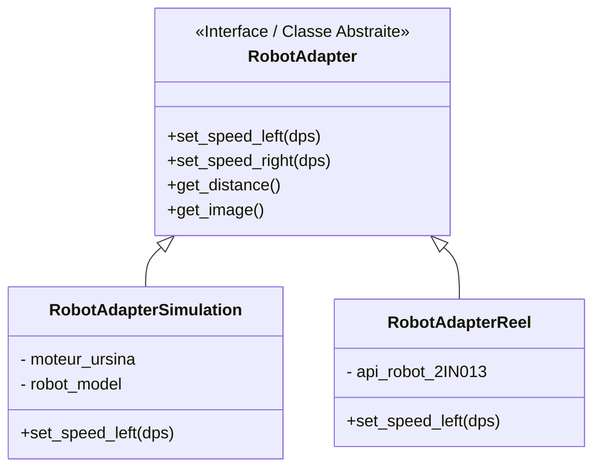

<div align="center">
  <h1>🤖 FWSFR - Framework de Stratégie pour Robotique</h1>
  <p><strong>Architecture logicielle pour le contrôle de robots différentiels (Simulés & Réels) avec vision par ordinateur.</strong></p>

  [](https://www.python.org/)
  [](https://opencv.org/)
  [](https://www.ursinaengine.org/)
  [](#)
</div>

---

## 📖 Sommaire
1. [À propos du projet](#-à-propos-du-projet)
2. [Architecture & Conception Logicielle](#-architecture--conception-logicielle)
   - [Le Pattern Adapter : S'abstraire du matériel](#1-le-pattern-adapter--sabstraire-du-matériel)
   - [Le Pattern Strategy : Cerveau du robot](#2-le-pattern-strategy--cerveau-du-robot)
3. [Algorithmique & Vision](#-algorithmique--vision)
4. [Structure du Projet](#-structure-du-projet)
5. [Installation & Lancement](#-installation--lancement)

---

## 🎯 À propos du projet

Ce projet implémente un framework robotique capable de **contrôler simultanément un robot physique** réel (capteurs infrarouges, caméra) et son **jumeau numérique en simulation 3D**.

L'objectif principal est de développer des comportements autonomes complexes (détection d'obstacles en environnement clos, suivi de balise par traitement d'image, séquences de déplacements) sans lier la logique de ces comportements au matériel. Ainsi, un algorithme d'IA ou de déplacement testé et mis au point en simulation fonctionnera à l'identique dans le monde réel, avec zéro modification du code décisionnel.

---

## 🏗 Architecture & Conception Logicielle

Pour garder le code propre et modulaire, deux Design Patterns majeurs sont déployés :

### 1. Le Pattern *Adapter* : S'abstraire du matériel

Le plus grand défi ici est la différence d'API entre les moteurs de simulation 3D (`Ursina`) et l'API d'un vrai robot (`Robot2IN013` communiquant par série/wifi).
L'interface `RobotAdapter` unifie tout : le code ne donne qu'un "set_speed_left()", et l'Adapter approprié gère la traduction.



### 2. Le Pattern *Strategy* : Cerveau du Robot

Les mouvements et les décisions du robot sont encapsulés dans des modules nommés "Stratégies".
Ces modules peuvent être testés de manière isolée et sont composables. On peut ordonner au robot de faire d'abord `Avancer`, puis s'il voit la balise, `Suivre Balise`, sinon `Tourner`.

```mermaid
graph TD
    A[<b>Classes de Base</b><br>Actions Unitaires] --> |"Sont assemblées par"| B(<b>Classes de Composition</b><br>Arbres de Décisions)
    A1(StrategyAvancer) --> A
    A2(StrategyTourner) --> A
    A3(StrategySuivreBalise) --> A
    
    B --> B1(StrategySequentielle<br/><i>Exécute les listes une à une</i>)
    B --> B2(StrategyConditionnelle<br/><i>Choisit via clause If/Else</i>)
    B1 -.-> |<i>"D'abord"</i>| A1
    B1 -.-> |<i>"Puis"</i>| A2
```

---

## 👁 Algorithmique & Vision

L'autonomie avancée repose sur les mathématiques et la vision par ordinateur **OpenCV** intégrée dans certaines stratégies (comme `StrategySuivreBalise`).

1. **Capture d'image RGB** : Via l'Adapter, on récupère un flux en provenance de la simulation ou de la caméra du robot.
2. **Espace de couleurs HSV** : Conversion vers l'espace *Teinte-Saturation-Valeur*, bien plus robuste aux variations de lumière ou d'ombres que le classique RGB.
3. **Segmentation** : Création de **masques binaires** par seuillage couleur précis (`cv2.inRange`) suivi de nettoyages morphologiques (*Opening/Closing*) pour effacer les pixels parasites.
4. **Calculs Dynamiques** : Exploitation des « moments » géométriques sur le masque final, afin d'y repérer le centre de gravité (le centroïde) de l'objet ou de la balise, dictant ainsi au robot des manœuvres différentielles automatiques par proportion.

---

## 📂 Structure du Projet

```text
PROJET-ROBOT/
├── src/
│   ├── FWSFR/
│   │   ├── adapter/          # Interfaces (Robot Réel / Simulation Ursina)
│   │   ├── algo_detection/   # Algorithmes OpenCV (Filtrage colorimétrique)
│   │   ├── model/            # Cinématique différentielle, Calculs Collision
│   │   ├── strategy/         # Implémentation du pattern Strategy
│   │   └── view/             # Scène 3D et rendu graphique par Ursina
│   │
│   ├── main3D.py             # ▶️ Lancer la simulation 3D
│   └── mainReel.py           # ▶️ Lancer le robot physique
└── README.md
```

---

## 🚀 Installation & Lancement

### Prérequis
Python 3.8 ou plus, doté de ces librairies (selon les composants nécessaires) :
```bash
pip install ursina opencv-python numpy
```

### 1. Démarrer la Simulation 3D
Idéal pour développer et tester sans matériel, génère le rendu d'un monde Ursina :
```bash
python src/main3D.py
```

### 2. Démarrer le Robot Physique
Connectez le robot par câble USB, Bluetooth, ou point d'accès réseau :
```bash
python src/mainReel.py
```
